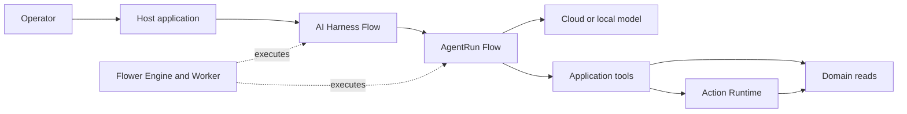

# Flower Agent Samples

Runnable reference applications for building tool-using agents on the Flower
JVM ecosystem. Each sample is a real application with an API, domain model,
tests, and observable execution state rather than an isolated SDK snippet.

> **Project status:** early reference implementation. The samples are intended
> for evaluation and architecture learning, not production deployment as-is.

## What these samples demonstrate

Flower projects keep different units of work under different owners:

| Project | Responsibility |
| --- | --- |
| [Flower](https://github.com/flowerjvm/flower) | Runs non-blocking `Flow` and `Step` orchestration. |
| [Flower Agent](https://github.com/flowerjvm/flower-agent) | Owns `AgentRun`, model turns, transcripts, tool calls, budgets, and completion. |
| [Flower AI Harness](https://github.com/flowerjvm/flower-ai-harness) | Validates final structured output and controls whole-task refinement or retry. |
| [Flower Action Runtime](https://github.com/flowerjvm/flower-action-runtime) | Governs mutating actions with validation, policy, idempotency, and audit. |
| Host application | Owns prompts, domain tools, data, security, API, UI, and deployment. |



## Included samples

| Sample | Scenario | Highlights |
| --- | --- | --- |
| [Game Server Operations](samples/game-server-ops/README.md) | Investigate a healthy or degraded game server and perform a governed restart when justified. | Web UI, nested Harness and Agent Flows, governed Action, and executable scripted/live evaluation. |
| [Customer Refund Operations](samples/customer-refund-ops/README.md) | Evaluate a customer refund request and execute only an eligible, policy-controlled refund. | Agent Recipe DSL, Harness retry, Action idempotency, executable evaluation, and Studio-linked Core/Agent/Harness/Action traces. |

The repository is one Gradle multi-project build. Every directory under
`samples/` is an independent runnable Spring Boot application.

## Prerequisites

- JDK 21
- An OpenAI-compatible `/chat/completions` endpoint for live runs
- A model with function/tool-calling support
- An API key only when the selected endpoint requires one

Normal tests are deterministic and do not call a model or require credentials.
The refund sample also has a deterministic evaluation command that emits both
evaluation and observation JSONL with matching trace identifiers, so Flower
Studio can open the exact execution behind each score.

## Build

The main `game-server-ops` runtime pins these Maven Central versions:

| Dependency | Version |
| --- | --- |
| Flower | `0.1.1` |
| Flower AI Harness | `0.1.2` |
| Flower Action Runtime | `0.3.1` |
| Flower Agent | `0.1.0` |

Its optional evaluation command follows `flower-evaluation:0.1.2-SNAPSHOT`
until that module receives a coordinated release. The integration snapshot
installer below prepares it as well.

```powershell
git clone https://github.com/flowerjvm/flower-agent-samples.git
cd flower-agent-samples
.\gradlew.bat :samples:game-server-ops:check
```

The `customer-refund-ops` integration sample targets the current development
snapshots so it can test the new cross-project observation adapters before a
coordinated release. Prepare sibling checkouts with:

```powershell
.\scripts\install-integration-snapshots.ps1
.\gradlew.bat check
```

Maven Local is filtered to `io.github.flowerjvm` snapshot versions only.
Released artifacts continue to resolve from Maven Central.

## Repository layout

```text
flower-agent-samples/
  build.gradle.kts
  settings.gradle.kts
  samples/
    game-server-ops/
      build.gradle.kts
      src/main/java/       Spring Boot host application
      src/main/resources/  configuration and browser UI
      src/test/java/       deterministic integration tests
    customer-refund-ops/
      build.gradle.kts
      src/main/java/       refund domain and four-runtime composition
      src/main/resources/  configuration
      src/test/java/       deterministic trace and behavior tests
```

## Credential policy

Live samples resolve an optional API key in this order:

1. `FLOWER_AGENT_API_KEY` environment variable
2. File named by `FLOWER_AGENT_API_KEY_FILE`

Do not put credentials in `application.yml`, Gradle properties, test fixtures,
browser storage, or the repository. The key file must live outside the
checkout. For deployed environments, use the platform secret manager and
expose the value only to the application process.

## Scope

These samples focus on integration boundaries and observable execution. They
intentionally omit production authentication, multi-instance coordination,
durable AgentRun persistence, human approval UI, and infrastructure-specific
secret management unless a sample explicitly says otherwise.

## License

Licensed under the [Apache License 2.0](LICENSE).
