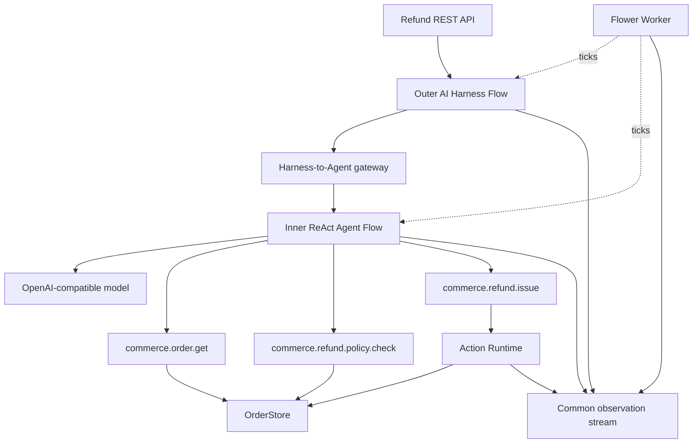

# Customer Refund Operations Agent

A compact end-to-end integration sample in which an agent inspects an order,
checks host-owned refund rules, and issues a governed refund only when the
current facts permit it.

This sample intentionally uses the current development snapshots. It validates
the common observation adapters added across Flower, Flower Agent, AI Harness,
and Action Runtime before those modules are released together.

## Scenarios

The in-memory order store starts with three useful cases:

| Order | Current fact | Expected result |
| --- | --- | --- |
| `order-1001` | Delivered 5 days ago, `54,000 KRW` | Governed refund, then verify `REFUNDED`. |
| `order-1002` | Delivered 45 days ago | `NO_ACTION_NEEDED`; refund window expired. |
| `order-1003` | Delivered 2 days ago, `240,000 KRW` | `MANUAL_REVIEW`; automatic limit exceeded. |

## Architecture



The host uses `AgentFlows.react(spec)` to create the inner Agent Flow. Flower
Agent still owns turns, transcripts, tool execution, budgets, retries, and
completion. The Recipe DSL only packages that existing Flow shape.

The outer Harness owns the final `RefundReport` contract. Its Jackson validator
rejects malformed or semantically inconsistent output, and its refine policy
can run a fresh Agent task. This retry does not bypass Action Runtime.

## Responsibility Boundaries

| Owner | Responsibility in this sample |
| --- | --- |
| Flower | Tick both Flows and emit Flow/Step trace events. |
| Flower Agent | Run the model/tool loop and emit Agent lifecycle events. |
| AI Harness | Build the task prompt, validate final JSON, retry, and extract findings. |
| Action Runtime | Validate, authorize, deduplicate, guard, execute, and audit the refund. |
| Host | Own orders, refund rules, tools, prompts, trace correlation, API, and secrets. |

The model can request a refund, but it cannot mutate `OrderStore`. Only
`IssueRefundAction` performs that change after Action Runtime accepts the
proposal. The pre-execution guard recalculates eligibility immediately before
execution.

Whole-task Harness retries share this idempotency scope:

```text
taskId + commerce.refund.issue + orderId
```

The deterministic test deliberately submits the same refund from a second
AgentRun. Action Runtime returns the prior successful result, while the domain
refund counter remains exactly one.

## Common Trace

The Host creates one `taskId` as the outer trace id and registers runtime
relationships as they are created:

```text
Harness run
  -> Agent run
      -> Action run
```

The common observation stream retains payload-light events from these sources:

- `flower-core`
- `flower-agent`
- `flower-ai-harness`
- `flower-action-runtime`

Prompt text, Tool input/output, customer identifiers, action output, and policy
reasons are not stored by the default adapters. The authoritative action audit
remains separate from the observation stream.

## Prepare Development Snapshots

Clone these repositories next to `flower-agent-samples`:

```text
flower/
flower-agent/
flower-ai-harness/
flower-action-runtime/
flower-agent-samples/
```

Then install the current snapshots into Maven Local:

```powershell
.\scripts\install-integration-snapshots.ps1
```

The Gradle build permits Maven Local only for `io.github.flowerjvm` snapshot
versions. Released dependencies continue to resolve from Maven Central.

## Test

No model server or API key is required:

```powershell
.\gradlew.bat :samples:customer-refund-ops:check
```

The tests prove:

- valid refund, expired-window, and manual-review outcomes;
- Harness validation and whole-task retry;
- Action validation, policy, pre-execution guard, audit, and idempotency;
- one correlated trace containing Core, Agent, Harness, and Action events;
- default observations do not retain business or model payloads.

## Run With A Model

The endpoint must implement OpenAI-compatible `/chat/completions` tool calling.

```powershell
$env:FLOWER_AGENT_BASE_URL = "https://api.openai.com/v1"
$env:FLOWER_AGENT_MODEL = "gpt-4.1-mini"
$env:FLOWER_AGENT_API_KEY_FILE = "C:\secure\flower-agent\openai-key"

.\gradlew.bat :samples:customer-refund-ops:bootRun
```

The application listens on `http://localhost:8091` by default.

## API

```powershell
$body = @{
    orderId = "order-1001"
    message = "Refund this delivered order only if the current policy allows it."
} | ConvertTo-Json

$task = Invoke-RestMethod `
    -Method Post `
    -Uri http://localhost:8091/api/refund-tasks `
    -ContentType application/json `
    -Body $body

Invoke-RestMethod "http://localhost:8091/api/refund-tasks/$($task.taskId)"
Invoke-RestMethod "http://localhost:8091/api/refund-tasks/$($task.taskId)/trace"
```

| Method | Path | Purpose |
| --- | --- | --- |
| `GET` | `/api/orders` | Read seeded order state. |
| `POST` | `/api/refund-tasks` | Start a Harness-owned Agent task. |
| `GET` | `/api/refund-tasks/{taskId}` | Read result, attempts, actions, audit, and trace counts. |
| `GET` | `/api/refund-tasks/{taskId}/trace` | Read the correlated payload-light event stream. |
| `POST` | `/api/refund-tasks/{taskId}/cancel` | Request cooperative cancellation. |
| `POST` | `/api/demo/reset` | Reset in-memory orders and observations. |

## Intentional Limitations

The sample uses in-memory orders, task state, transcripts, action runs,
duplicate tracking, audit, and observations. It is suitable for one process and
serialized demo execution. A multi-instance deployment must replace these with
durable, concurrency-safe implementations and add authentication, approval,
retention, access control, and a real payment provider.
