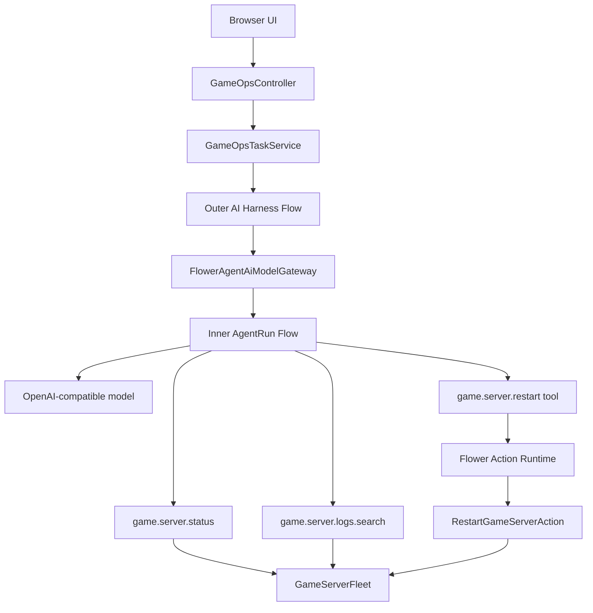

# Game Server Operations Agent

A runnable Spring Boot sample in which an operator asks an agent to inspect a
game server, gather evidence, and request a controlled restart only when the
observed state justifies it.

The application uses an OpenAI-compatible cloud or local model. Its useful
capabilities come from application-defined tools rather than tools bundled into
the Agent runtime.

## Try the two scenarios

The in-memory demo starts with two servers:

| Server | Initial state | Expected agent behavior |
| --- | --- | --- |
| `server-alpha` | `DEGRADED` | Read status and logs, request a governed restart, then verify the final state. |
| `server-beta` | `HEALTHY` | Read status and logs, report that no action is needed, and leave the server unchanged. |

Example operator requests:

```text
Investigate server-alpha. Restart it only if the current state and logs justify it, then verify the final state.
```

```text
Check server-beta and do not restart it unless there is clear evidence of a problem.
```

Korean requests work as well when the selected model supports Korean:

```text
server-alpha 상태와 최근 오류 로그를 조사하고, 필요한 경우에만 재시작한 뒤 최종 상태를 확인해 주세요.
```

## Architecture

There are two Flower Flows, even though this sample does not define a custom
Flow class. Each runtime factory builds its own Flow and the host submits both
to the configured `ai-control` Worker.



### Outer Harness Flow

```text
prepare-prompt
  -> await-response
  -> validate-response
  -> refine-decision
  -> emit-findings
```

The Harness owns the final `IncidentReport` contract. It validates the Agent's
JSON and may repeat the whole Agent task when the result cannot be refined into
that contract.

### Inner Agent Flow

```text
initialize-run
  -> prepare-context
  -> await-model-turn
  -> interpret-decision
  -> execute-tools
  -> prepare-context
  -> ...
  -> finalize-run
```

Flower Agent owns model turns, the complete tool-call transcript, budgets,
retry of the current model turn, cancellation, and completion routing.

### Worker and non-blocking waits

`flower-spring-boot-starter` reads `application.yml`, creates the Flower
`Engine` and the real `ai-control` Worker, and starts its tick scheduler with
the Spring application lifecycle.

`GameOpsFlowSubmitter` is deliberately small. It routes a Flow through the
Engine to that Worker:

```java
engine.submit(GameOpsFlowSubmitter.WORKER_NAME, flow);
```

The Worker only advances short Flow ticks. Model HTTP calls are asynchronous,
and the mutating tool uses a bounded executor, so the Worker thread does not
block while external work is in flight.

## Runtime ownership

| Runtime | Owns in this sample |
| --- | --- |
| Flower | Outer and inner Flow execution, Step transitions, Worker lifecycle. |
| Flower Agent | AgentRun, turns, transcript, tool loop, budgets, completion. |
| AI Harness | Prompt task, final JSON validation, whole-task refinement and retry, findings. |
| Action Runtime | Restart validation, policy, duplicate handling, execution result, audit. |
| Host application | Game-server state, tools, prompts, API, browser UI, configuration. |

The retry boundaries are intentionally different:

| Retry owner | Meaning |
| --- | --- |
| Agent | Retry the current failed model turn. |
| AI Harness | Repeat the whole Agent task because the final structured result is invalid. |
| Action Runtime | Apply action-specific execution and duplicate policy. |

## Tools and action boundary

| Model-visible tool | Type | Implementation |
| --- | --- | --- |
| `game.server.status` | Read-only | Reads one server snapshot. |
| `game.server.logs.search` | Read-only | Searches bounded recent in-memory logs. |
| `game.server.restart` | Mutating request | Creates an `ActionProposal`; it does not mutate the server directly. |

Only `RestartGameServerAction` performs the domain mutation. Before it runs,
Action Runtime checks:

- the action and input are registered and valid;
- the principal is the trusted `game-server-ops-agent`;
- the principal has the `GAME_OPERATOR` role;
- the server is currently `DEGRADED`;
- the stable idempotency key has not already produced an applicable result.

Whole-task Harness retries use this idempotency scope:

```text
taskId + game.server.restart + serverId
```

The same task can therefore retry its AgentRun without restarting the same
server twice.

## Run from source

JDK 21 is required. Until Flower Agent `0.1.0` is published, first follow the
[root build instructions](../../README.md#build) to install its snapshot.

### OpenAI API

```powershell
$env:FLOWER_AGENT_BASE_URL = "https://api.openai.com/v1"
$env:FLOWER_AGENT_MODEL = "gpt-4.1-mini"
$env:FLOWER_AGENT_API_KEY = "<read from your secret store>"

.\gradlew.bat :samples:game-server-ops:bootRun `
    '-PuseMavenLocal=true' `
    '-PflowerAgentVersion=0.1.0-SNAPSHOT'
```

### Local OpenAI-compatible server

```powershell
$env:FLOWER_AGENT_BASE_URL = "http://localhost:11434/v1"
$env:FLOWER_AGENT_MODEL = "qwen3:8b"
Remove-Item Env:FLOWER_AGENT_API_KEY -ErrorAction SilentlyContinue

.\gradlew.bat :samples:game-server-ops:bootRun `
    '-PuseMavenLocal=true' `
    '-PflowerAgentVersion=0.1.0-SNAPSHOT'
```

The endpoint must implement compatible `/chat/completions` tool calling. Model
quality and tool-call support vary across local models.

Open [http://localhost:8090](http://localhost:8090) after the application
starts.

## API

| Method | Path | Purpose |
| --- | --- | --- |
| `GET` | `/api/config` | Read non-secret endpoint and model readiness. |
| `GET` | `/api/servers` | Read the current in-memory server fleet. |
| `POST` | `/api/tasks` | Start one Harness-owned Agent task. |
| `GET` | `/api/tasks/{taskId}` | Observe Harness, Agent, Tool, Action, audit, and report state. |
| `POST` | `/api/tasks/{taskId}/cancel` | Request cooperative cancellation. |
| `POST` | `/api/demo/reset` | Restore initial server state after active tasks finish. |

## Code map

| Package | Responsibility |
| --- | --- |
| `api` | REST endpoints and UI-facing task views. |
| `task` | Host task lifecycle and in-memory task registry. |
| `harness` | Prompt, structured report, findings, and Harness-to-Agent bridge. |
| `workflow` | Routes generated Flows to the configured Worker. |
| `tool` | Model-visible domain capabilities and pollable tool execution. |
| `action` | Restart definition, validation, authorization policy, execution, and audit sink. |
| `domain` | In-memory game-server fleet, snapshots, state, and logs. |
| `config` | Spring wiring for model, Agent, Harness, Action Runtime, and domain services. |

The static browser UI is under `src/main/resources/static`.

## Test

```powershell
.\gradlew.bat :samples:game-server-ops:check `
    '-PuseMavenLocal=true' `
    '-PflowerAgentVersion=0.1.0-SNAPSHOT'
```

The deterministic integration test uses a scripted model. It proves that an
outer Harness retry creates two Agent runs while Action Runtime idempotency
allows only one actual domain restart. No API key is required.

## Credentials

The application accepts a key from `FLOWER_AGENT_API_KEY` or from the file
named by `FLOWER_AGENT_API_KEY_FILE`. The key is never returned by the
configuration endpoint.

```powershell
$env:FLOWER_AGENT_API_KEY_FILE = "C:\secure\flower-agent\openai-key"
```

Keep the file outside this repository and protect it with OS or secret-manager
access controls.

## Intentional limitations

The domain, task registry, transcript, action runs, and audit events are
in-memory and disappear when the process stops. This first sample intentionally
omits approval and resume, JDBC persistence, MCP, RAG, multi-instance duplicate
coordination, production authentication, and direct connection to a real game
server.
